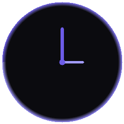

# Pomodoro

A beautiful, distraction-free Pomodoro timer that stays out of your way and helps you stay in the zone.

Built with Go and [Ebiten](https://ebitengine.org/). Single binary, no runtime dependencies — just download and focus.



## Screenshots

| Dark Theme | Light Theme | Settings |
|:---:|:---:|:---:|
|  |  |  |

| Mini Mode | Light Settings |
|:---:|:---:|
|  |  |

## Why Pomodoro?

Most timer apps are either bloated Electron wrappers or ugly CLI tools. This one is different.

**It's gorgeous.** A smooth progress ring, clean typography, and a transparent borderless window that floats on your desktop like it belongs there. Switch between dark and light themes, dial in the transparency — make it yours.

**It sounds right.** A gentle tick keeps you aware that time is moving without breaking your concentration. When the session ends, an alarm brings you back. Both sounds have independent volume controls — or turn them off entirely if you prefer silence.

**It disappears when you don't need it.** Shrink to **mini mode** — a tiny floating counter in the corner of your screen that shows the remaining time without stealing focus. Or close the window entirely and let the **system tray** icon keep working in the background. Click to restore anytime.

**It just works.** One binary, zero dependencies. No accounts, no subscriptions, no telemetry. Your settings are a plain JSON file. It starts instantly and uses barely any resources.

## Features

- **Focus / Break / Long Break** cycle with configurable durations
- **Dark and Light themes** with adjustable window transparency
- **Tick sound** during focus sessions — stay aware of time passing without looking at the screen
- **Alarm sound** on session completion — never miss a break or overshoot a focus block
- **Independent volume controls** for tick and alarm — fine-tune or mute each one separately
- **Mini mode** — a compact floating timer that stays out of your way
- **System tray** — close to tray, restore on click, keeps running in the background
- **HiDPI support** — crisp vector rendering on high-density displays
- **Keyboard shortcuts** — Space (start/pause), R (reset), S (settings), Escape (back)
- **AppImage** packaging for Linux
- **Cross-platform** — builds for Linux, macOS, and Windows

## Install

### From source

Requires Go 1.25+ and C compiler.

**Linux** (needs X11 and audio dev libraries):
```bash
sudo apt install libx11-dev libgl1-mesa-dev libxcursor-dev libxrandr-dev \
  libxinerama-dev libxi-dev libasound2-dev libayatana-appindicator3-dev libxxf86vm-dev
make build
```

**Windows / macOS**:
```bash
go build -o pomodoro ./cmd/pomodoro/
```

### AppImage (Linux)

```bash
make appimage
# Output: build/pomodoro-<version>-x86_64.AppImage
```

### System install (Linux)

```bash
sudo make install
# Installs binary, .desktop file, and icon
```

## Configuration

Settings are stored in `~/.config/pomodoro/config.json`:

| Setting | Default |
|---|---|
| Focus duration | 25 min |
| Break duration | 5 min |
| Long break duration | 15 min |
| Rounds before long break | 4 |
| Auto-start next session | off |
| Tick sound | on, 50% volume |
| Alarm volume | 80% |
| Theme | dark |
| Transparency | 10% |

All settings are adjustable from the in-app settings screen (press S or click the gear icon).

## Building

```bash
make build      # Build binary
make test       # Run tests
make appimage   # Build Linux AppImage
make icon       # Regenerate app icon
make clean      # Remove build artifacts
```

## License

See [LICENSE](LICENSE).
